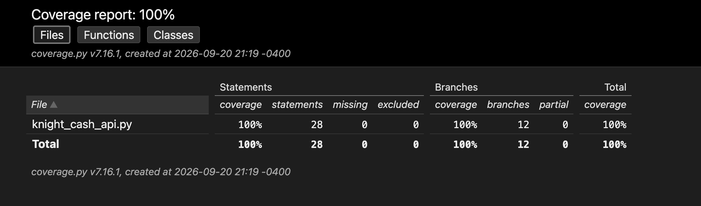

# Week 4 Assignment: AI-Augmented TDD & Branch Coverage — Audit Report

**Note on `knight_cash_api.py`:** the source file was not distributed with this assignment. Using ai, I reconstructed a `knight_cash_api.py` that matches the assignment brief.

## 1. The Bug Log

- **No validation on transfer amount (allowed negative and zero transfers).** The original `transfer()` did `accounts[from] -= amount` / `accounts[to] += amount` with no check on `amount`. A negative amount silently reversed the direction of a transfer (stealing funds by "sending" a negative amount to another account), and a `0.0` amount produced a fake "successful" transfer. **Fix:** added `if req.amount <= 0: raise HTTPException(400, ...)` before applying the transfer.
- **No insufficient-funds check (unlimited overdraft).** The original code let `from_account`'s balance go arbitrarily negative, since nothing compared `amount` to the current balance. This meant an account with 0 gold could still "send" money it didn't have. **Fix:** added `if accounts[req.from_account] < req.amount: raise HTTPException(400, "Insufficient funds")`.
- **No account-existence validation (crashed with an unhandled 500 instead of a clean 404).** Both `/balance/{account_id}` and `/transfer` indexed straight into the `accounts` dict (`accounts[account_id]`), so a nonexistent account raised an uncaught `KeyError`, which FastAPI turns into a 500 Internal Server Error. This is both a poor API contract and a robustness/DoS-adjacent issue (unhandled exceptions on attacker-controlled input). **Fix:** added explicit `if account_id not in accounts: raise HTTPException(404, ...)` checks in both endpoints before touching the dict.

(A fourth, lower-severity issue was also caught and fixed: transferring an account to itself (`from_account == to_account`) was allowed with no check, which is a meaningless no-op transfer that should be rejected as a 400.)

## 2. Coverage Proof

Final run:

```
Name                 Stmts   Miss Branch BrPart  Cover   Missing
----------------------------------------------------------------
knight_cash_api.py      28      0     12      0   100%
----------------------------------------------------------------
TOTAL                   28      0     12      0   100%
```

100% branch coverage (target was >95%), generated via:

```
pytest --cov=knight_cash_api --cov-report=html --cov-branch
```



## 3. Prompt Audit (Step 4)

Every branch was already exercised once the negative/zero/insufficient-funds/missing-account/self-transfer tests existed, but the boundary case of transferring the *exact* full balance (the edge of the "insufficient funds" `if` condition) needed its own explicit test to be sure the `<` comparison (not `<=`) was correct. The prompt used to generate that case:

> "Write a specific Pytest case that will trigger the exact-balance boundary of this if statement: `if accounts[req.from_account] < req.amount:`. I want a test where the transfer amount equals the sender's full balance exactly — this should succeed (leaving a balance of 0), not be rejected as insufficient funds."

This produced `test_transfer_exact_balance_is_allowed` in `test_knight_cash.py`.

## 4. GitHub Link

https://github.com/GrantBonzo/test_driven_dev

(See commit history for the Red → Green progression: the first commit contains the reconstructed original buggy API plus the failing pytest suite; the second commit contains the fixes and the now-passing suite.)
